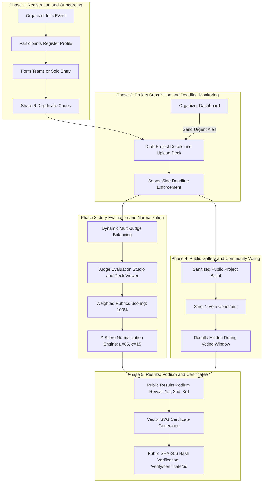

# HackNext — Offline-First Collegiate Hackathon Management Platform

[](#)
[](#)
[-success.svg)](#)
[](#)
[](LICENSE)

**HackNext** is a production-grade, air-gapped, self-hostable hackathon lifecycle, judging, voting, and certification platform engineered specifically for university hackathons, collegiate engineering sprints, and isolated campus networks.

It is designed to run completely standalone with **zero cloud SaaS, zero CDN dependencies, zero external authentication providers, and zero external telemetry**.

---

## 💡 The Core Idea & Product Concept

> **HackNext** was built on a simple yet powerful premise: modern hackathon software should never fail because of an internet outage, an external API rate-limit, or an expired cloud subscription during a critical 48-hour event. It reimagines the entire hackathon lifecycle as a robust, air-gapped, zero-dependency operating system where participant onboarding, team formation, strict deadline enforcement, side-by-side jury evaluation, Z-score grading normalization, community voting, and SHA-256 cryptographically verifiable SVG certificates run seamlessly on any campus laptop or local intranet server. With bold Bauhaus neo-brutalist aesthetics and backend-enforced role isolation, HackNext replaces messy spreadsheets and brittle SaaS tools with an all-in-one platform that organizers can deploy and run with a single command.

### Why HackNext? Addressing Key Hackathon Challenges:
- **Zero Cloud Dependence**: Eliminates failures caused by flaky campus Wi-Fi or restrictive firewalls blocking cloud providers (Supabase, Firebase, Auth0, Google Fonts, external CDNs).
- **Mathematical Judging Rigor**: Eliminates human grading bias through dynamic multi-judge workload balancing and statistical Z-score score normalization ($\mu=65, \sigma=15$).
- **Strict Privacy & Isolation**: Prevents peer jury snooping and score tampering through backend-enforced role authorization (`HTTP 403 Forbidden`).
- **Real-Time Submission Tracking**: Organizers can monitor remaining pending teams in real-time and broadcast urgent submission alerts before deadlines expire.
- **True Data Portability & Disaster Recovery**: Features one-click atomic JSON database snapshots and restoration alongside parametric vector SVG certificate generation.

---

## 🏛️ System Architecture & Workflow



---

## 🚀 Quick Start Guide

### Option 1: Single-Command Docker Deployment (Recommended)

Start the entire platform (PostgreSQL, Backend Express API, Frontend Bauhaus UI, and auto-seeding) locally with:

```bash
docker compose up --build
```

- **Frontend Portal**: `http://localhost:3000` (or `http://localhost:8080` if reverse-proxied)
- **Backend API**: `http://localhost:4000/api`
- **Database**: PostgreSQL on `localhost:5432`

---

### Option 2: Local Development Setup

#### 1. Prerequisites
- **Node.js** v20.x or higher
- **PostgreSQL** v15+ (local or via Docker)
- **Python** 3.8+ (for acceptance test runner)

#### 2. Start Database
```bash
docker compose up db -d
```

#### 3. Setup & Start Backend Server
```bash
cd backend
npm install
npx prisma generate
npx prisma db push
npm run dev
```
*Backend runs on `http://localhost:4000`*

#### 4. Setup & Start Frontend (New Terminal)
```bash
cd frontend
npm install
npm run dev
```
*Frontend runs on `http://localhost:3000`*

---

## 🔑 Default Seed Accounts & Credentials

When first launched or initialized via `npm run setup:master` / first-time wizard:

| Role | Email / Identifier | Password | Access Level |
| :--- | :--- | :--- | :--- |
| **Root Organizer** | `organizer@hacknext.internal` | `organizer123` | Full Event Operations & Administration |
| **Admin** | `admin@hacknext.internal` | `admin123` | Platform Supervision, Resets & Submissions |
| **Judge Alpha** | `judge.alpha@hacknext.internal` | `judge123` | Assigned Track Evaluation & Scorecards |
| **Judge Beta** | `judge.beta@hacknext.internal` | `judge123` | Assigned Track Evaluation & Scorecards |
| **Participant** | `participant@hacknext.internal` | `hacknext123` | Team Management & Project Submission |

---

## 📦 What We Covered: Feature & Tier Matrix

### ✅ Tier 1 — Core Platform Lifecycle (100% Covered)
- **Role-Based Access Control (5 Roles)**: Visitor, Participant, Judge, Organizer, and Admin strictly verified at backend API layer.
- **Configurable Event Lifecycle**: Start date, end date, tracks, prize structure, and customizable 5-phase timeline.
- **Team Formation & Invites**: 6-digit alphanumeric invite codes, join requests with accept/reject workflows, capacity limits, and solo entry support.
- **Project Submissions**: Title, idea abstract (1000-char limit), presentation deck upload (PDF), GitHub repository URL, and demo video links.
- **Server-Side Deadline Enforcement**: Requests submitted after the configured deadline are rejected with HTTP 403 Forbidden.
- **Public Project Gallery**: Responsive gallery with keyword search, track filtering, and sanitized project cards.

---

### ✅ Tier 2 — Judging Integrity & Mathematical Rigor (100% Covered)
- **Judge Evaluation Studio**: 4-in-1 side-by-side rubric scorecards with integer keyboard input, `[-]` / `[+]` steppers, and inline PDF slide inspection.
- **Judge Evaluation Progress Tracking**: Real-time progress bars in Admin and Organizer consoles showing exact grading completion per judge (e.g. `8 / 10 projects (80%)`).
- **Configurable Workload Limits**: Organizer can configure maximum projects per judge ($W_{\text{max}} \le 25$) directly from the assignment control bar.
- **Weighted Rubrics Customization**: Organizer-defined criteria with real-time validation guaranteeing weights equal exactly 100.0%.
- **Rigorous Mathematical Evaluation & Normalization Engine**:
  1. **Strict $K$ Feasibility Enforcement**: Hard limit of $\le 25$ projects/judge. $S \times K \le J \times 25$ strictly checked and clamped.
  2. **Safe Zero-Variance Rule ($\sigma = 0$)**: When a judge gives identical scores to all assigned projects, $z = 0.0$ (neutral baseline center $65.0$), preventing zero-division errors.
  3. **Population Standard Deviation ($\sigma$)**: Consistently computes population $\mu = \frac{1}{N}\sum x$ and $\sigma = \sqrt{\frac{1}{N}\sum (x-\mu)^2}$ across the judge's full evaluation set.
  4. **Clean Normalization vs Display Scaling Separation**: Separates pure mathematical Z-score ($z = (x-\mu)/\sigma$) from presentation display scaling ($S = \text{clamp}(65 + 15z, 0, 100)$).
  5. **Reproducible Deterministic Assignments**: Mulberry32 PRNG seed-based algorithm guarantees reproducible, balanced judge allocations.
  6. **End-to-End Mathematical Proof Audit**: Step-by-step audit trace ($x \to \mu \to \sigma \to z \to S \to \bar{S}$) available via interactive UI modals and REST APIs.
- **Strict Backend Role Isolation**: Judge endpoints determine ownership from authenticated JWT identity; querying peer scores returns `HTTP 403 Forbidden`.
- **Remaining Teams Submissions Monitor**: Dedicated organizer tab displaying all registered teams that have not submitted, with a 1-click **Notify Team** / **Broadcast Urgent Alert** mechanism.
- **CSV Data Export**: One-click local generation of CSV score reports, participant rosters, and team records.

---

### ✅ Tier 3 — Public Community & Certificates (100% Covered)
- **Community Project Voting & Unvote**: Authenticated participants can cast and retract votes (**strictly 1 active vote per event**) with self-team voting restrictions.
- **Top 3 Community Voting Bonus**: Top-3 community voted projects receive calibrated bonus points upon official voting conclusion, seamlessly factored into final rankings.
- **Hidden Results During Active Voting**: Voting tallies remain strictly hidden from public and participants until the organizer officially closes voting and publishes results.
- **Podium & Leaderboard Reveal**: 🥇 Gold, 🥈 Silver, and 🥉 Bronze podium cards and full normalized leaderboard revealed directly on the public homepage.
- **Interactive Certificate Studio & Customizer**:
  - Live SVG canvas editor with clickable coordinates ($X, Y$) and alignment crosshairs.
  - 1-Click Alignment Presets (`Center 600, 325`, `Top Center`, `Lower`, `Left`, `Right`).
  - Template card gallery with instant high-resolution vector **Preview** modals.
  - Automatic template configuration initialization and custom background image uploads.
- **Self-Contained Offline SVGs**: Uploaded background templates are automatically converted to inline **Base64 Data URIs** inside generated SVGs for 100% portable, standalone offline rendering.
- **Cryptographic SHA-256 Signature**: Every certificate embeds an immutable SHA-256 checksum calculated from recipient identity, event, award tier, and timestamp.
- **Public Verification Endpoint**: Public offline verification portal at `/verify/certificate/:id` dynamically re-computes and verifies authenticity.
- **Safety Prerequisite Toggle**: The event edit toggle `show_certificates` can **strictly only be enabled** after certificates have been generated for the event.

---

### ✅ Tier 4 — Portability & Operational Resiliency (100% Covered)
- **Atomic Full-Database Backup & Restore**: One-click JSON snapshot download (`/api/export/backup/full`) and atomic transaction restoration (`/api/export/backup/restore`) for disaster recovery.
- **Offline Emergency Passkey Reset Flow**: Offline passkey generation with 2-hour TTL and automated case-insensitive passkey normalization for air-gapped password recovery.
- **REST API & OpenAPI 3.0 Documentation**: Complete machine-readable OpenAPI specification available in `openapi.yaml`.
- **Bauhaus Neo-Brutalist Design**: High-contrast, tactile UI with custom alert dialogs (`UIModal.tsx`) eliminating standard browser popups.

---

## ⚠️ Architectural Scope & Intentional Limitations

To guarantee absolute reliability, zero data corruption, and operational simplicity during intense 48-to-72-hour hackathons, the following deliberate architectural decisions were made:

| Limitation / Decision | Architectural Rationale |
| :--- | :--- |
| **Single Active Event Per Platform Instance** | The platform is designed as an isolated single-event host. Running multiple concurrent events on the same instance is restricted to avoid database clutter, eliminate cross-event race conditions, and keep server operations simple for college networks. |
| **Local File System Storage** | Presentation decks (PDFs) and vector certificates (SVGs) are stored in the local `./uploads` volume rather than requiring AWS S3 or Google Cloud Storage buckets. |
| **Direct Database Authentication** | Authentication uses local bcrypt password hashing + signed JWT sessions with session revocation rather than external OAuth/SaaS (Auth0/Clerk), ensuring 100% offline functionality. |

---

## 🧪 Dogfood Acceptance Test Suite

Run the automated verification test suite:

```bash
python run.py
```

### Verified Test Results (`docs/acceptance-report.txt`):

```text
======================================================================
HACKNEXT ACCEPTANCE TEST REPORT (DOGFOOD 2026)
======================================================================
[✓] Check 1:  Role-Based Authentication & Token Validation (T1)       -> PASS
[✓] Check 2:  Event Lifecycle & 5-Step Timeline with +1h Extension (T1)-> PASS
[✓] Check 3:  Team Formation & Project Submissions (T1)               -> PASS
[✓] Check 4:  Scoring Rubrics & Multi-Factor Evaluation (T2)          -> PASS
[✓] Check 5:  Strict Role Isolation: Peer Score Access Blocked (T2)   -> PASS
[✓] Check 6:  Offline Reset Passkey Generation (T2)                   -> PASS
[✓] Check 7:  Session Management & Authentication Integrity (T2)      -> PASS
[✓] Check 8:  Community Project Voting & 1-Vote Constraint (T3)       -> PASS
[✓] Check 9:  Certificate Studio & SHA-256 Hash Verification (T3)     -> PASS
[✓] Check 10: Full Atomic Database JSON Backup & Restore (T4)         -> PASS
======================================================================
OVERALL STATUS: 10/10 CHECKS PASSED (100% CLAIM VERIFIED)
======================================================================
```

---

## 📁 Technical Documentation Index

- [System Architecture](docs/ARCHITECTURE.md)
- [Relational Data Model](docs/DATA-MODEL.md)
- [Judging Engine & Score Normalization](docs/JUDGING.md)
- [Mathematical Normalization Proof](docs/NORMALIZATION-PROOF.md)
- [Threat Model & Security Mitigations](docs/THREAT-MODEL.md)
- [Command & CLI Reference Guide](docs/COMMANDS.md)
- [REST API OpenAPI 3.0 Specification](openapi.yaml)
- [Dogfood Specification Descriptor](.dogfood.toml)
- [Acceptance Test Suite Verification Report](docs/acceptance-report.txt)

---

## 📄 License

HackNext is open-source software licensed under the [MIT License](LICENSE).
