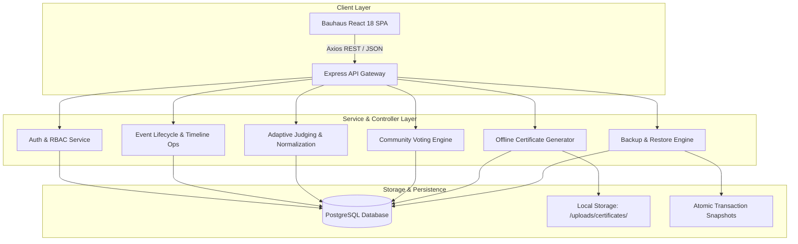

# System Architecture & Technical Specification

## 1. Overview
**HackNext** is a production-grade, offline-first, self-hostable collegiate hackathon management platform. Built to operate seamlessly inside air-gapped or localized university network environments, it requires zero external internet access, third-party SaaS authentication, or cloud CDN infrastructure.

---

## 2. High-Level System Architecture

---

## 3. Core Subsystems

### 3.1 Bauhaus Neo-Brutalist Design System
- **Visual Language**: Bold 4px solid borders, high-contrast monochrome palettes with Bauhaus primary accents (Crimson `#E11D48`, Cobalt `#2563EB`, Canary `#EAB308`, Emerald `#10B981`), hard drop shadows (`8px 8px 0px #000`), uppercase typography, and zero rounded fluff.
- **Accessibility & Themes**: Pure CSS dark mode toggle with persistent local state.
- **Zero Native Alerts**: All modals and toasts use custom `UIModal.tsx` components.

### 3.2 Certificate Generation Studio
- **Architecture Reference**: Modeled after `D:\college\PROJECTS\Certify` parameterization engine.
- **Vector Engine**: Pure mathematical SVG rendering on the backend, generating vector certificates with zero external font or binary dependencies.
- **Cryptographic Verification**: Every certificate embeds an immutable SHA-256 integrity hash calculated from recipient name, team, event, award title, and issuance timestamp.
- **Public Checksum Endpoint**: Anyone can verify validity offline via `/verify/certificate/:id` or API `/api/certificates/verify/:certNo`.
- **Toggle Safety Rule**: The event-level `show_certificates` toggle can **only** be activated after certificates have been generated.

### 3.3 Event Lifecycle & Timeline Operations
- **Predefined 5-Phase Sequence**:
  1. `Registration` (Participant onboarding and team formation)
  2. `Project Submission` (Repository and metadata submission before deadline)
  3. `Evaluation` (Judge assignment, criteria rubric grading, and Z-score normalization)
  4. `Community Voting` (Title & description gallery with strict 1-vote constraint)
  5. `Result Out` (Podium reveal, certificates, and final leaderboard)
- **Live Extension Controls**: Organizers can click `+1 Hour` extension or `Close Phase Now` on any active round.

### 3.4 Adaptive Dynamic Judging & Normalization
- **Scale-Aware Assignment**: Dynamically calculates consensus depth $K$ ($1 \le K \le 3$) based on submissions $S$ vs. available judges $J$.
- **Z-Score Cross-Judge Normalization**: Rescales judge scores to target $\mu=65, \sigma=15$ to eradicate grading bias.
- **Strict Role Isolation**: Peer judge score access is blocked at the routing layer (returns HTTP 403).

### 3.5 Full Server Portability & Disaster Recovery
- **Atomic Full Export**: Generates a single `.json` snapshot of all 14 database tables.
- **Atomic Transactional Restore**: Re-imports all tables within a unified `prisma.$transaction` block, ensuring zero corrupted or partial state.

---

## 4. Technology Stack

| Layer | Technology | Purpose |
|---|---|---|
| Frontend Framework | React 18 + Vite | Single Page Application |
| Styling | Tailwind CSS | Bauhaus neo-brutalist UI |
| Icons | Lucide React | Offline vector iconography |
| Backend Runtime | Node.js v20+ / TypeScript | Express REST API |
| Database & ORM | PostgreSQL + Prisma ORM | Relational data store |
| Security | Bcrypt.js + JWT | Offline cryptographic auth |
| Containerization | Docker & Docker Compose | Self-hosted orchestration |
