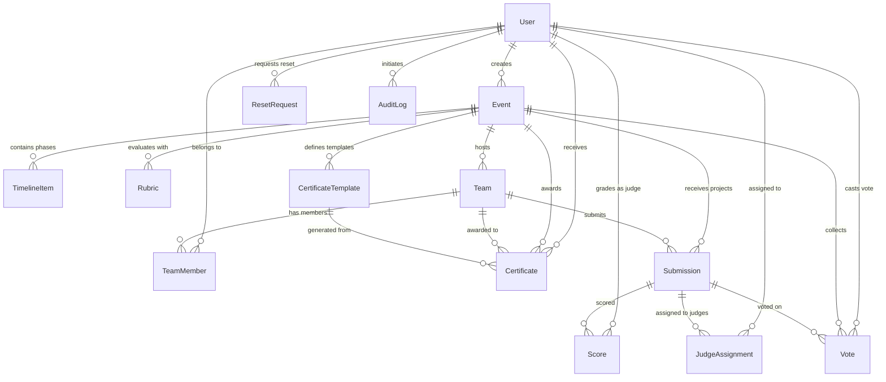

# HackNext Data Model Specification

This document details the complete relational data model for **HackNext**, implemented using **PostgreSQL** and **Prisma ORM**.

---

## 1. Relational Entity Relationship Diagram

---

## 2. Model Definitions

### 2.1 User
| Field | Type | Description |
|---|---|---|
| `id` | UUID (PK) | Unique user identifier |
| `name` | String | Full name |
| `email` | String (Unique) | Contact email address |
| `staff_id` | String? (Unique) | Internal institutional / college ID |
| `password_hash` | String | Bcrypt hash |
| `role` | Enum (`ADMIN`, `ORGANIZER`, `JUDGE`, `PARTICIPANT`) | Authorization role |
| `college` | String? | Institutional affiliation |
| `created_at` | DateTime | Timestamp of registration |
| `must_change_password` | Boolean | Force password rotation flag |
| `session_version` | Int | Active session counter for concurrent revocation |

### 2.2 Event
| Field | Type | Description |
|---|---|---|
| `id` | UUID (PK) | Unique event identifier |
| `name` | String | Event name |
| `tagline` | String? | Short summary |
| `description` | String | Full event description |
| `start_date` | DateTime | Official start datetime |
| `end_date` | DateTime | Official conclusion datetime |
| `max_team_size` | Int | Max participants per team (default 4) |
| `is_published` | Boolean | Public visibility toggle |
| `results_published` | Boolean | Final winners & leaderboard visibility toggle |
| `show_certificates` | Boolean | Certificate verification & view toggle (requires prior generation) |
| `show_public_voting` | Boolean | Public voting gallery display toggle |
| `community_voting_open` | Boolean | Active community ballot acceptance toggle |
| `tracks` | JSON | Configurable track categories |
| `prizes_config` | JSON | Podium prizes & special award definitions |
| `created_by_id` | UUID (FK) | Reference to creating organizer/admin |

### 2.3 TimelineItem (5-Step Lifecycle)
| Field | Type | Description |
|---|---|---|
| `id` | UUID (PK) | Unique phase identifier |
| `event_id` | UUID (FK) | Reference to Event |
| `title` | String | Phase name (`Registration`, `Project Submission`, `Evaluation`, `Community Voting`, `Result Out`) |
| `start_datetime` | DateTime | Phase start time |
| `end_datetime` | DateTime? | Phase deadline (organizer can apply `+1 Hour` extensions) |
| `sort_order` | Int | Linear timeline sequence |

### 2.4 Rubric (Evaluation Criteria)
| Field | Type | Description |
|---|---|---|
| `id` | UUID (PK) | Unique rubric identifier |
| `event_id` | UUID (FK) | Reference to Event |
| `name` | String | Criterion title (e.g. *Innovation & Novelty*, *Technical Complexity*) |
| `description` | String | Guidance instructions for judges |
| `weight` | Float | Percentage weight (total across criteria must sum to 100%) |
| `max_score` | Float | Maximum score points (default 10) |
| `sort_order` | Int | Ordering index |

### 2.5 Team & TeamMember
- **Team**: Manages team names, invitation codes (`invite_code`), and references `Event`.
- **TeamMember**: Join table linking `User` and `Team` with role (`LEADER`, `MEMBER`).

### 2.6 Submission
| Field | Type | Description |
|---|---|---|
| `id` | UUID (PK) | Unique submission identifier |
| `team_id` | UUID (FK) | Submitting Team |
| `event_id` | UUID (FK) | Event |
| `title` | String | Project Title |
| `description` | String | Project abstract / description |
| `repo_url` | String? | Source repository link |
| `demo_url` | String? | Live demo or preview link |
| `track` | String? | Selected competition track |
| `is_submitted` | Boolean | Lock status |
| `submitted_at` | DateTime? | Final submission timestamp |

### 2.7 Score & JudgeAssignment
- **Score**: Records judge ratings per rubric criterion (`raw_score`, `feedback`), submitted by assigned `JUDGE`.
- **JudgeAssignment**: Links `Judge` to specific `Submission` for workload balancing and consensus.

### 2.8 Vote (Community Ballot)
| Field | Type | Description |
|---|---|---|
| `id` | UUID (PK) | Unique ballot identifier |
| `event_id` | UUID (FK) | Target Event |
| `user_id` | UUID (FK) | Logged-in voter (strictly 1 vote per user per event) |
| `submission_id` | UUID (FK) | Chosen project (strictly title & description in gallery) |
| `created_at` | DateTime | Timestamp of cast vote |

### 2.9 CertificateTemplate & Certificate
- **CertificateTemplate**: Configurable SVG layout definition for `WINNER_1ST`, `WINNER_2ND`, `WINNER_3RD`, `PARTICIPANT`, and custom tracks.
- **Certificate**: Generated recipient vector award with cryptographic SHA-256 integrity hash, unique `certificate_no` (e.g. `HN-2026-WIN1-ABCD1234`), local filesystem path, and public verification at `/verify/certificate/:id`.

### 2.10 ResetRequest & AuditLog
- **ResetRequest**: Offline password reset request with 15-minute expiring cryptographic passkeys.
- **AuditLog**: Immutable system audit trail for security critical operations.
