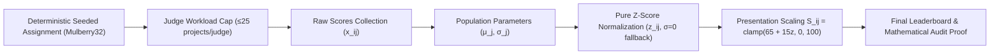

# JUDGING.md — Mathematical Evaluation, Assignment & Score Normalization Engine

This document specifies the **Mathematical Evaluation, Reproducible Assignment, and Score Normalization Engine** for HackNext.

---

## The 6 Core Mathematical & Architectural Principles

---

### 1. Hard Capacity Limit & Feasible $K$ Enforcement
- **Hard Limit**: Every judge has a strict maximum evaluation capacity of **$W_{\text{max}} = 25$ projects**.
- **Total Capacity**: $C = J \times 25$ total reviews across $J$ available judges.
- **Feasibility Condition**: For $S$ submissions and requested consensus depth $K$:
  $$S \times K \le C \iff K \le \min\left(J, \left\lfloor \frac{J \times 25}{S} \right\rfloor\right)$$
- If the requested $K$ exceeds the maximum feasible $K_{\text{max}} = \lfloor C / S \rfloor$, the system **strictly clamps** $K$ to $K_{\text{max}}$ rather than overloading judges beyond 25 projects.

---

### 2. Population Standard Deviation ($\sigma$)
Because each judge $j$ evaluates their entire finite population of $N_j$ assigned projects for the event, we use the **population standard deviation** ($\sigma_j$) dividing by $N_j$ (not sample variance $N_j - 1$):

$$\mu_j = \frac{1}{N_j} \sum_{i=1}^{N_j} x_{i,j}$$

$$\sigma_j = \sqrt{\frac{1}{N_j} \sum_{i=1}^{N_j} (x_{i,j} - \mu_j)^2}$$

---

### 3. Safe Zero-Variance Handling ($\sigma = 0$)
If a judge assigns identical scores to all evaluated projects (or evaluates only 1 project), variance is zero ($\sigma_j = 0$).
- **Rule**: When $\sigma_j = 0$, define $z_{i,j} = 0.0$.
- **Rationale**: Setting $z = 0.0$ preserves mathematical fairness by placing the project at the neutral baseline center ($65.0$) rather than dividing by zero or applying arbitrary multipliers.

---

### 4. Separation of Normalization from Display Scaling
Normalization and presentation are cleanly separated into two distinct steps:

1. **Pure Mathematical Normalization (Z-Score)**:
   $$z_{i,j} = \begin{cases} \frac{x_{i,j} - \mu_j}{\sigma_j} & \text{if } \sigma_j > 0 \\ 0.0 & \text{if } \sigma_j = 0 \end{cases}$$

2. **Presentation Display Scaling (0–100 Presentation Range)**:
   $$S_{i,j} = \text{clamp}(65 + 15 \cdot z_{i,j}, 0, 100)$$
   *(where baseline mean is centered at 65.0 and 1 standard deviation is 15.0 points, cleanly covering $[-2\sigma, +2\sigma] \to [35, 95]$)*.

3. **Project Consensus Aggregate**:
   $$\bar{S}_i = \frac{1}{|J_i|} \sum_{j \in J_i} S_{i,j}$$

---

### 5. Reproducible Deterministic Judge Assignments
- Assignments are generated deterministically using a seeded pseudo-random number generator (**Mulberry32**) initialized with `assignment_seed`.
- Rerunning the assignment with the same seed, submission list, and judge roster produces the exact same balance and judge pairings.
- The assignment engine balances judge workloads using a priority queue sorted by `workload_j` ascending with deterministic seeded tie-breaking.

---

### 6. Per-Project Mathematical Audit Trace & Proof Modal
Every scored project provides an end-to-end mathematical audit trail:
$$x_{i,j} \longrightarrow \mu_j \longrightarrow \sigma_j \longrightarrow z_{i,j} \longrightarrow S_{i,j} \longrightarrow \bar{S}_i$$

Accessible via:
- **UI Modal**: Clicking **"Math Proof"** in Participant Results, Public Podium, or Organizer Submissions.
- **REST Endpoints**:
  - `GET /api/evaluation/event/:eventId/proof/:submissionId`
  - `GET /api/evaluation/event/:eventId/leaderboard`
  - `GET /api/organizer/events/:id/normalization-proof`
